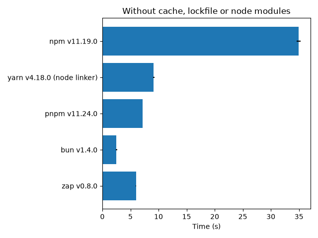
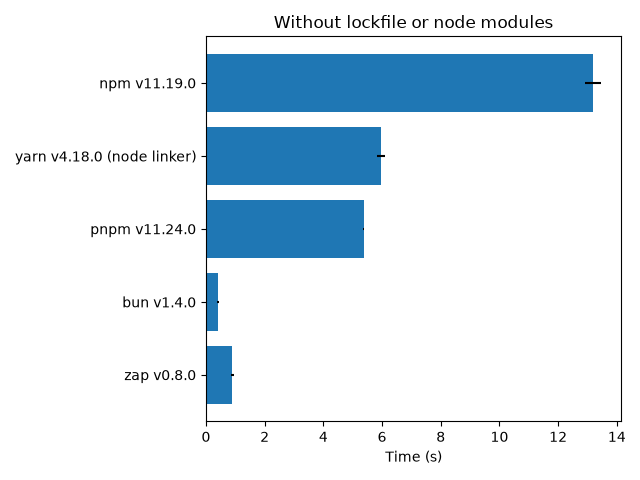
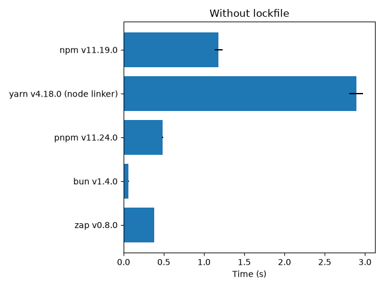
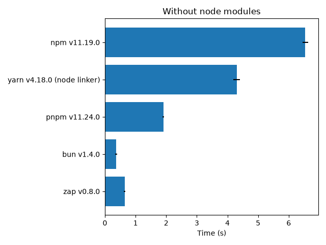

<div align="center">
	
  <h6><i><a href="https://www.flaticon.com/free-icons/comic" title="logo">Logo created by Freepik - Flaticon</a></i></h6>
  <h3>Another [insert blazing fast synonyms] JavaScript package manager</h3>
  <a href="https://github.com/elbywan/zap/actions/workflows/build.yml?query=branch%3Amain+workflow%3ABuild"></a>
  <a href="https://www.npmjs.com/package/@zap./zap"></a>
  <a href="https://github.com/elbywan/zap/blob/main/LICENSE"></a>
</div>

---

<div align="center">


**`Zap` is a JavaScript package manager _(think npm/pnpm/yarn)_ that aims to be quick, reliable, memory efficient and developer friendly.**

</div>

---

### Disclaimer

Zap is a **hobby** project that I am currently working on in my free time. Documentation is sparse, Windows support is partial at best and the code is not yet ready for production.

I am not looking for contributors at the moment, but feel free to open an issue if you have any question or suggestion.

> [!WARNING]
> **Use it at your own risk.**

## Installation

```bash
npm i -g @zap./zap
zap --help
```

## Commands

| Command       | Aliases               | Description                                            | Status  |
| ------------- | --------------------- | ------------------------------------------------------ | ------- |
| `zap install` | `i` `add`             | Install dependencies                                   | ✅       |
| `zap remove`  | `rm` `uninstall` `un` | Remove dependencies                                    | ✅       |
| `zap init`    | `create`              | Create a new project or initialize a package.json file | ✅       |
| `zap dlx`     | `x`                   | Execute a command in a temporary environment           | ✅       |
| `zap store`   | `s`                   | Manage the store                                       | ✅       |
| `zap run`     | `r`                   | Run a script defined in package.json                   | ✅       |
| `zap rebuild` | `rb`                  | Rebuild installed native node addons                   | ✅       |
| `zap exec`    | `e`                   | Execute a shell command in the scope of the project    | ✅       |
| `zap update`  | `up` `upgrade`        | Update dependencies                                    | ✅ |
| `zap why`     | `y`                   | Show information about why a package is installed      | ✅       |
| `zap patch`   |                       | Extract a package for editing, to be patched           | ✅       |
| `zap patch-commit` |                 | Generate and register a patch from an edited package   | ✅       |
| `zap dedupe`       |                 | Collapse compatible duplicate versions into the highest in use | ✅ |
| `zap pack`        |                 | Generate a self-contained, deterministic tarball from a package | ✅ |

#### Check the [project board](https://github.com/users/elbywan/projects/1/views/1) for the current status of the project.

## Features

Here is a non exhaustive list of features that are currently implemented:

- **Classic (~npm), isolated (~pnpm) or plug'n'play (~yarn) install strategies**

```bash
# Classic install by default
zap i # or zap i --classic
# Isolated install
zap i --isolated
# Plug'n'play (experimental - no zero-installs yet)
zap i --pnp
```

_or:_

```json
"zap": {
  "strategy": "isolated",
  "hoist_patterns": [
    "react*"
  ],
  "public_hoist_patterns": [
    "*eslint*", "*prettier*"
  ]
}
// package.json
```

- **[Workspaces](https://docs.npmjs.com/cli/v9/using-npm/workspaces?v=true#defining-workspaces)**

```json
"workspaces": [
  "core/*",
  "packages/*"
]
// package.json
```

_or to prevent hoisting:_

```json
"workspaces": {
  "packages": [
    "packages/**"
  ],
  "nohoist": [
    "react",
    "react-dom",
    "*babel*"
  ]
}
// package.json
```

```bash
# Install all workspaces
zap i
# Using pnpm-flavored filters (see: https://pnpm.io/filtering)
zap i -F "./libs/**" -F ...@my/package...[origin/develop]
zap i -w add pkg

## Scripts can be scoped too

# Run a single script in the current workspace.
zap run my-script
# Run scripts in all workspaces in parallel.
# Will use topological ordering by default - dependencies will run first…
zap -r run test
# …or omit the "run" argument.
zap -r test
# Scope to the dependencies of a specific workspace, and pack the output.
zap -F "my_app^..." --deferred-output run build
# Disregard the topological ordering and run the scripts in parallel.
zap run --parallel -r build
```

- **Dependency updates**

```bash
# Update everything within declared ranges
zap up
# Bump direct dependencies to their latest version, rewriting package.json
zap up --latest
# Re-resolve transitive dependencies too
zap up --latest --recursive
# Update specific packages, optionally to a range
zap up react react-dom@^18.0.0
# Pick packages interactively (/ searches, f filters by bump severity)
zap up --interactive
```

- **[Private registries](https://docs.npmjs.com/cli/v10/configuring-npm/npmrc#auth-related-configuration)**

```ini
; .npmrc file

; default registry:
registry=https://registry.yarnpkg.com/
; scoped registries:
@myorg:registry=https://somewhere-else.com/myorg
@another:registry=https://somewhere-else.com/another
; scoped authentication: (supported fields -> _auth, _authToken, certfile, keyfile)
//registry.org/:_auth=BASICAUTHTOKEN
//registry.npmjs.org/:_authToken=BEARERTOKEN
; disable strict ssl peers checking: (default is true)
strict_ssl=false
; use a custom certificate authority file:
cafile=/certs/rootCA.crt
```

- **[Overrides](https://docs.npmjs.com/cli/v9/configuring-npm/package-json?v=true#overrides) / [Package Extensions](https://pnpm.io/package_json#pnpmpackageextensions)**

```json
"overrides": {
  "foo": {
    ".": "1.0.0",
    "bar": "1.0.0"
  }
},
"zap": {
  "package_extensions": {
    "react-redux@1": {
      "peerDependencies": {
        "react-dom": "*"
      }
    }
  }
}
// package.json
```

- **[Aliases](https://github.com/npm/rfcs/blob/main/implemented/0001-package-aliases.md)**

```bash
zap i my-react@npm:react
zap i jquery2@npm:jquery@2
zap i jquery3@npm:jquery@3
```

- **Apply patch files to installed dependencies** (like pnpm's `patchedDependencies`)

```bash
# Extract an installed package to a temporary directory for editing
zap patch some-package@1.0.0
# Edit the files in the printed directory, then commit the changes
zap patch-commit /tmp/zap-patch-some-package-1.0.0-abc123
# The patch is saved to patches/some-package@1.0.0.patch and registered in
# the "zap" section of package.json. The next install applies it.
```

Patches are applied to the linked node_modules copy after install; the store keeps the pristine package. Editing a patch file re-applies it to the affected package on the next install, and a changed patch makes frozen installs fail until the lockfile is regenerated (run `zap i --frozen-lockfile=false`). A `patched_dependencies` key that matches no installed package fails the install (a stale or mistyped key); set `allow_unused_patches: true` to warn instead. Patch files are plain git-style unified diffs, so they can also be hand-written or produced by `git diff` and registered under `zap.patched_dependencies` in package.json. The key matches the exact version, any range, or the bare package name:

```json
{
  "zap": {
    "patched_dependencies": {
      "some-package@1.0.0": "patches/some-package@1.0.0.patch"
    }
  }
}
```

- **Strict and safe by default**

Dependency build scripts (`preinstall`/`install`/`postinstall`) do not run
unless the package is explicitly allowlisted; the root project's own scripts
still run:

```json
{
  "zap": {
    "only_built_dependencies": ["esbuild", "@swc/core"],
    "ignored_built_dependencies": ["fsevents"]
  }
}
```

`zap approve-builds` lists the dependencies with pending build scripts
(including the implicit `binding.gyp` node-gyp builds) and persists your
choices. `dangerously_allow_all_builds: true` restores the previous
run-everything behavior, and `--ignore-scripts` still disables everything.

Newly resolved versions younger than `minimum_release_age` (default `7d`)
are refused, quarantining typosquats and freshly compromised releases.
Lockfile-pinned versions are trusted and exempt; `0` disables the check,
`minimum_release_age_exemptions` and the `--allow-recent` flag bypass it.
Registries without publish times fail open, or fail closed with
`minimum_release_age_ignore_missing_time: false`:

```json
{
  "zap": {
    "minimum_release_age": "24h"
  }
}
```

`default_semver_range_prefix` selects the operator used when saving a new
dependency (`"^"` by default, `"~"`, or `""` for exact versions). With
`block_exotic_subdeps: true`, transitive dependencies must resolve from the
registry: git, tarball, file and workspace sources are refused for anything
you did not explicitly declare. `--check-resolutions` (default on CI)
verifies that the lockfile resolutions satisfy the declared ranges, catching
a tampered lockfile.

`trust_policy: "no-downgrade"` refuses a version whose trust evidence is
weaker than the previously locked versions (a publisher signature or
provenance attestation cannot silently disappear on an update);
`trust_policy_exclude` bypasses specific packages. `named_registries`
defines registry aliases usable as a specifier prefix, and the lockfile
records the registry so a same-name package from another registry cannot be
substituted:

```json
{
  "zap": {
    "named_registries": {
      "work": "https://npm.work.example.com/"
    }
  },
  "dependencies": {
    "@corp/lib": "work:^2.0.0"
  }
}
```

# Benchmarks

### a.k.a is it fast?

## Methodology

Benchmarks consist on installing a fresh [**create-react-app**](https://create-react-app.dev/) in various scenarii, with postinstall scripts disabled.

**See:** [https://github.com/elbywan/zap/tree/main/bench](/bench)

They are run automatically on GitHub Actions (ubuntu-latest) by the [**Benchmark workflow**](https://github.com/elbywan/zap/actions/workflows/benchmark.yml) and refreshed on pushes to main that touch the benchmark or packages.

The benchmarking tool is [**hyperfine**](https://github.com/sharkdp/hyperfine), with 1 warmup run and 3 measured runs per scenario.

I am aware that this is not a very scientific approach, but it should give rough good idea about what zap is capable of. Absolute times vary between machines — the relative ordering is the signal. Re-measure on your own hardware by running `./bench.sh` locally or by triggering the workflow manually (Actions → Benchmark → Run workflow).

## Results

[](https://github.com/elbywan/zap/actions/workflows/benchmark.yml)

<!-- bench-results:start -->

| Scenario | npm v11.19.0 | yarn v4.18.0 | pnpm v11.24.0 | bun v1.4.0 | zap v0.8.0 |
| --- | --- | --- | --- | --- | --- |
| Without cache, lockfile or node modules | 35.0 s | 9.1 s | 7.2 s | **2.4 s** | 6.0 s |
| Without lockfile or node modules | 13.1 s | 6.0 s | 5.4 s | **388 ms** | 881 ms |
| Without lockfile | 1.2 s | 2.9 s | 482 ms | **62 ms** | 378 ms |
| Without node modules | 6.5 s | 4.3 s | 1.9 s | **356 ms** | 643 ms |

Median of 3 runs after 1 warmup, measured on 2026-08-30.
Results generated by [this workflow run](https://github.com/elbywan/zap/actions/runs/33308845665).

<!-- bench-results:end -->






## Why?

**This is a legitimate question.** There are already a lot of package managers out there, and they all have their own pros and cons. So why another one?

First, I thought that it would be a good and fun challenge to build a package manager from scratch. I also really like the [Crystal language](https://crystal-lang.org/) and I have been using it for a couple of years now. So it would be a good opportunity to put my knowledge to the test.

I also experimented with a lot of package managers over the years, and I have a few praise and gripes with the existing ones:

- [npm](https://www.npmjs.com/) is the de facto standard for JavaScript package management. It is reliable and has a huge community. But it is also super slow and lack features introduced by other package managers over time even though it is trying to catch up.

- [yarn](https://yarnpkg.com/) is a great alternative to npm, it was a pioneer initially in terms of speed and it introduced many improvements and innovations along the years. Yarn is also impressively reliable which is paramount. I never used yarn berry in a significant project but the PnP approach is very interesting - unfortunately the downside is that does not seem to be compatible out of the box with a lot of packages from the ecosystem.

- [pnpm](https://pnpm.io/) is an impressive package manager which introduced the concept of isolated installs. It handles workspaces very well with a lot of options to customize the behavior. Speed is mostly fine even with big monorepos. I experienced some reliability issues using it over the years though (peer dependencies handling, lockfile inconsistencies, very high memory consumption, need to manually delete the node modules folder…).

- [bun](https://bun.sh/) was a great source of inspiration for this project, but it comes with tradeoffs. While tremendously fast, it did not support some critical features when I started working on zap (and it still is very feature-limited), cannot be considered reliable as of today and is not as flexible as I would like it to be.

- newer contenders ([orogene](https://github.com/orogene/orogene), [cotton](https://github.com/danielhuang/cotton), [ultra](https://github.com/nachoaldamav/ultra)…) are kind of interesting but they are clearly lacking in terms of features and/or reliability and/or speed.

#### So I decided to build a package manager that would be fast, flexible and easy to use. For my own personal use, but also for the community (in the long run).

### How?

Zap is written in [Crystal](https://crystal-lang.org/) which is a compiled language, which means that it should be faster than JavaScript. It can easily tap into system calls and use the fastest ones depending on the platform (_for instance [clonefile](https://www.manpagez.com/man/2/clonefile/)_). It is also an excellent fit when dealing with concurrent tasks.

Crystal also has _experimental_ support for parallelism and can dispatch fibers to a pool of worker threads, which means that zap can take advantage of multiple cores. This is especially useful when dealing with CPU-bound tasks.

On top of that, zap will also try to cache package manifests in order to avoid unnecessary network calls in a performant way using [messagepack](https://msgpack.org/).

## Development

### Prerequisites

- [Install crystal](https://crystal-lang.org/install/)
- _(optional)_ Install the [vscode extension](https://marketplace.visualstudio.com/items?itemName=crystal-lang-tools.crystal-lang) and [crystalline](https://github.com/elbywan/crystalline)

### Setup

```bash
git clone https://github.com/elbywan/zap
crystal projects.cr install
# Run the specs
crystal projects.cr spec
# Build locally
crystal projects.cr build:cli --production --release --progress
# Run the binary
./packages/cli/bin/zap --help
```

The binary runs on Crystal's execution contexts: installs are single-threaded by default
and can be parallelized at runtime with `--workers <n>` (or the `ZAP_WORKERS` env var),
`--workers 1` is single-threaded, higher values enable multi-threaded resolution:

## Contributing

1. Fork it (<https://github.com/elbywan/zap/fork>)
2. Create your feature branch (`git checkout -b my-new-feature`)
3. Commit your changes (`git commit -am 'Add some feature'`)
4. Push to the branch (`git push origin my-new-feature`)
5. Create a new Pull Request

## Contributors

- [Julien Elbaz](https://github.com/your-github-user) - creator and maintainer

## Related

- [pnpm](https://pnpm.io/)
- [bun](https://bun.sh/)
- [npm](https://www.npmjs.com/)
- [yarn](https://yarnpkg.com/)
